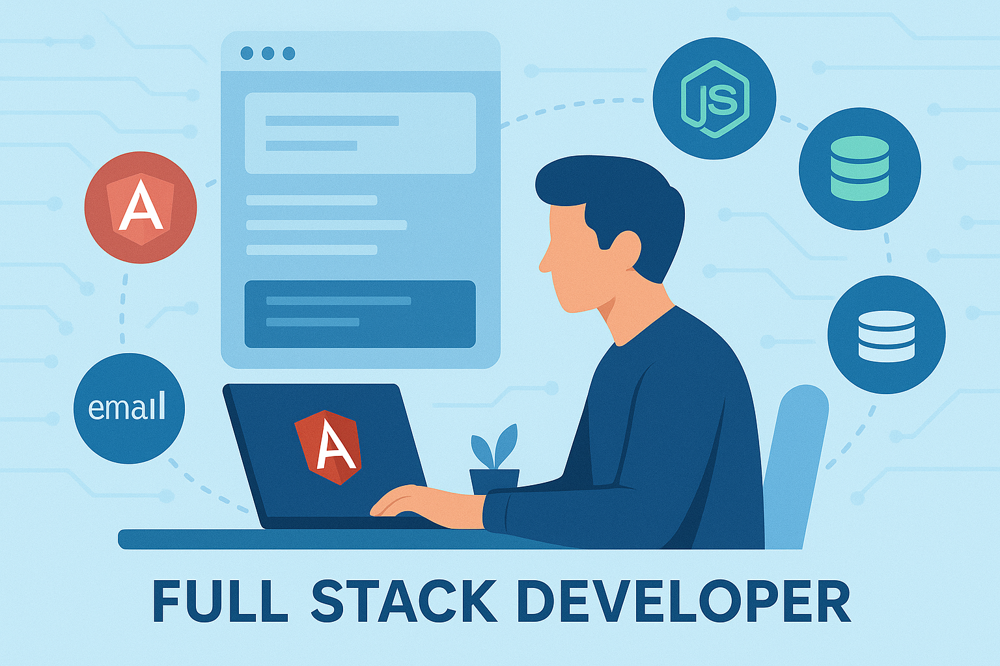

<h1 align="center">Hi 👋, I'm Tirth Shah</h1>
<h3 align="center">Full Stack Developer | Angular • Node.js | 2+ Yrs Experience</h3>

  
  
  

---

### 👨‍💻 About Me

- 💼 Software Developer @ **Arbelos Solutions**  
- 💻 Previously at **Samcom Technobrains** & **Cutting Edge Infotech**
- 🧠 Learning Full Stack: **Node.js**, **Express**, **Django**
- 🚀 2+ years experience with **Angular**, **RxJS**, **Material**, **NG-ZORRO**
- 📂 Actively building full-stack projects with real APIs
- 🎯 Goal: To work on scalable full-stack products in a growth-driven team
- 📄 [Check out my Resume](https://drive.google.com/your-resume-link)

---

### 🛠️ Tech Stack

#### 👨‍🎨 Frontend

#### 🌐 Backend

#### 🧰 Tools & Platforms

---

### 📊 GitHub Stats

  
  

  

---

### 🤝 Let’s Connect

  
  
  

---

> 🚀 *“Always building. Always learning.”*
